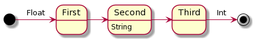
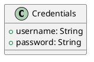
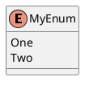
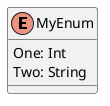

# FlowKit

FlowKit is a library for building finite state machines for Android and iOS.

Finite state machines are a good way to formalize the logic needed to describe a discreet set of steps.

FlowKit is especially useful for defining business logic, screen-to-screen flows within your mobile app, or even managing complex state within your screens.

Many problems can be broken down into states and transitions and are well suited for State Machines.
These finite state machines can be used to control and manage navigation between screens.

## Quick Start

Check out the [Installation Guide](docs/installation.md) for installing FlowKit for iOS and Android

## How it works

### Defining State Machines

You define a state machine using a [plant uml file](https://plantuml.com/state-diagram). The state machine defines all states, and transitions between states. You can also define a required context type for the state.

Here is a simple puml that defines a simple, linear state machine with 3 explicit states (plus a `begin` and `end` state).

```plantuml
[*] -> First: Float
First -> Second
Second -> Third
Second: String
Third -> [*]: Int
```



### Code Generation

This in turn is used to generate Swift or Kotlin code to drive the state machine. We generate code that will allow the compiler to enforce the state machine. It won't compile unless you implement every state handler, with the correct context type and a valid transition.

#### States

An enumeration is generated to represent each state within the state machine. Each state has a context, but will default to `Void` / `Unit`

```swift
public enum MyState: FlowState {
    case begin(_ context: Float)
    case first(_ context: Void)
    case second(_ context: String)
    case third(_ context: Void)
    case end(_ context: Int)
}
```

#### Transitions

Each transition is also modeled as an enumeration with all possible paths in the state machine along with the required context needed to make the transition.
```swift
public enum Begin {
    case second(_ context: Float)
}

public enum First {
    case second(_ context: Void)
}

public enum Second {
    case Third(_ context: String)
}

public enum Third {
    case end(_ context: Void)
}

public enum End {
    case end(_ context: Int)
}
```

#### The State Machine

In addition to the enumeration, a protocol / interface is defined that defines state handlers for each state. As the state machine is processed each handler is called as a state is entered. Each state handler call receives the current state, the context associated with that state and must return the next state transition.

The StateMachine also defines an `Input` and `Output` type.

```swift
public protocol MyStateMachine: StateMachine where State == MyState, Input == Void, Output == Void {
    func onBegin(state: MyState, context: Float) -> Promise<MyState.Begin>
    func onFirst(state: MyState, context: Void) -> Promise<MyState.First>
    func onSecond(state: MyState, context: String) -> Promise<MyState.Second>
    func onThird(state: MyState, context: Void) -> Promise<MyState.Third>
    func onEnd(state: MyState, context: Int) -> Promise<MyState.End>
}
```

#### The Flow Controller

Now that you have an interface / protocol that is generated, you implement a flow controller.
To implement your flow controller, you simply conform to the protocol / interface and implement the required handlers. The compiler will validate the correctness of your state machine in terms of input, outputs, and possible state transitions.

```swift
class MyFlowController: MyStateMachine {
    ...
    func onBegin(state: MyState, context: Float) -> Promise<MyState.Begin> { ... }
    func onFirst(state: MyState, context: Void) -> Promise<MyState.First> { ... }
    func onSecond(state: MyState, context: String) -> Promise<MyState.Second> { ... }
    func onThird(state: MyState, context: Void) -> Promise<MyState.Third> { ... }
    func onEnd(state: MyState, context: Int) -> Promise<MyState.End> { ... }
    ...
}
```

### Asynchronous handlers with Promises

You might have noticed that the return type is a promise. A promise is an asynchronous type that promises to eventually return the type in a callback. FlowKit uses the excellent project [PromiseKit](https://github.com/mxcl/PromiseKit) for iOS and [PromiseKt](https://github.com/inmotionsoftware/promisekt) a kotlin port of PromiseKit for Android.

By returning promises instead of directly returning the next state we can use our state machine to make asynchronous calls, such as network calls, accessing files, etc.


#### Screens / Views
FlowKit encourages an asynchronous model for screens. The idea is simple, each screen can be conceptualized as a function that takes an input and (eventually) returns an output.

```swift
func onLogin(state: AppState, context: Void) -> Promise<AppState.Login> {
    return self.subflow(to: LoginFlowController(), context: context)
        .map { token -> AppState.Login in .home(token.token) }
}
```

This inversion of control allows us to compose screens that have no dependency on any other screen, make no direct network calls, and is generally self contained. They are only responsible for transforming their input into output. It encourages composability by treating screens as a simple function call with a well defined set of behaviors.

Obviously not all screens fit this model, but a vast majority do.

#### FlowControllers

Your `StateMachine` defines an `Input` and `Output`, these are used to define the interface to call your `FlowController`. This interface also uses promises, in effect a `StateMachine` is also considered a function that takes an `Input` and returns an `Output`.

```swift
func startFlow(context: Input) -> Promise<Output> { ... }
```

### Handling Errors

Errors are managed by the promise library. A promise is resolved with a `Result` that can either be a `success` or a `failure`. When an uncaught exception propagates up the promise chain your StateMachine will transition to a special state called `Fail`. There is also a special handler you can override to handle the error. By default this handler will transition to a special terminal state called `terminate` which ends the state machine.

```swift
extension MyFlowController {
    func onFail(state: MyState, context: Error) -> Promise<MyState.Fail> {
        return Promise.value(.terminate(context))
    }
}
```

You can override `onFail` to customize the behavior. You could, for example, restart the state machine, or log the error, etc.

### Resolving a State Machine

To resolve a state machine you transition to a special state called the `end` state. By default this state will transition to a final terminal state called `terminate`. You can override the default handler with your own. This can be used to do any final validation, or maybe intercept the output and transform it, or kick you back into the state machine, etc.

```swift
extension MyFlowController {
    func onEnd(state: MyState, context: Void) -> Promise<MyState.End> {
        return Promise.value(.terminate(context))
    }
}
```

As the final stage in the state machine the `terminate` state is called. This can also be overridden to change the default behavior, but unlike `onEnd` and `onFail` handlers, once `onTerminate` is called no further transitions are possible, you can still transform the final result status, log it, etc. Note that if the returning promise is resolved to an error, `onFail` is not called again, the state machine is fully resolved at this point as an error.

```swift
extension MyFlowController {
    func onTerminate(state: State, context: Result<Output, Error>) -> Promise<Output> {
        switch (context) {
        case .success(let val): return Promise.value(val)
        case .failure(let err): return Promise(error: err)
        }
    }
}
```

# Generating Model classes

FlowKit can be used to generate simple model classes. This is useful when passing complex types between states, you can define the type directly in the puml file and let FlowKit generate the kotlin / swift code. This is limited to simple POJO objects, it has no support for inheritance, abstract classes, constructors, etc.



Will generate the following swift:

```swift
public struct Credentials {
    public username: String
    public password: String
}
```

And the following Kotlin:
```kotlin
data class Credentials(
    val username: String,
    val password: String
)
```

You can also generate enums as well:


This will generate swift:

```swift
enum MyEnum {
    case one
    case two
}
```

and Kotlin:
```kotlin
enum class MyEnum {
    One,
    Two
}
```

You can create enums with associated values


This will generate:

```swift
enum MyEnum {
    case one(_ context: Int)
    case two(_ context: String)
}
```

This works for Kotlin as well, in this case a `sealed class` is used
```kotlin
sealed class MyEnum {
    class One(val context: Int): MyEnum()
    class Two(val context: String): MyEnum()
}
```

<!--
## Example
[Example Login Flow](example/ios/ExampleFlow/Flows/LoginFlowStateMachine.swift)

```swift
public class LoginFlowController: ViewCache, NavStateMachine, LoginFlowStateMachine {

    public var nav: UINavigationController!
    public typealias State = LoginFlowState
    private let service = UserService()

    public func onBegin(state: State, context: Void) -> Promise<State.Begin> {
        return Promise.value(.prompt(nil))
    }

    public func onPrompt(state: State, context: String?) -> Promise<State.Prompt> {
        return self.subflow(to: LoginView.self, context: context)
            .map {
                switch ($0) {
                    case .forgotPassword(let email): return .forgotPass(email)
                    case .login(let email, let pass): return .authenticate(Credentials(username: email, password: pass))
                    case .register: return .createAccount(nil)
                }
            }
            .back { .prompt(context) }
            .cancel { .prompt(context) }
    }

    public func onAuthenticate(state: State, context: Credentials) -> Promise<State.Authenticate> {
        return self.service
            .autenticate(credentials: context)
            .map { .end($0) }
            .recover { Promise.value(.prompt($0.localizedDescription)) }
    }

    public func onForgotPass(state: State, context: String) -> Promise<State.ForgotPass> {
        return self
            .subflow(to: ForgotPasswordViewController.self, nib: "ForgotPassword", context: context)
            .map { .prompt($0) }
            .canceled { _ in .prompt(nil) }
            .recover { Promise.value(.prompt($0.localizedDescription)) }
    }

    public func onCreateAccount(state: State, context: String?) -> Promise<State.CreateAccount> {
        return self.subflow(to: CreateAccountFlowController(), context: context)
            .map { .authenticate($0) }
            .back{ .prompt(nil) }
    }
}
``` -->
