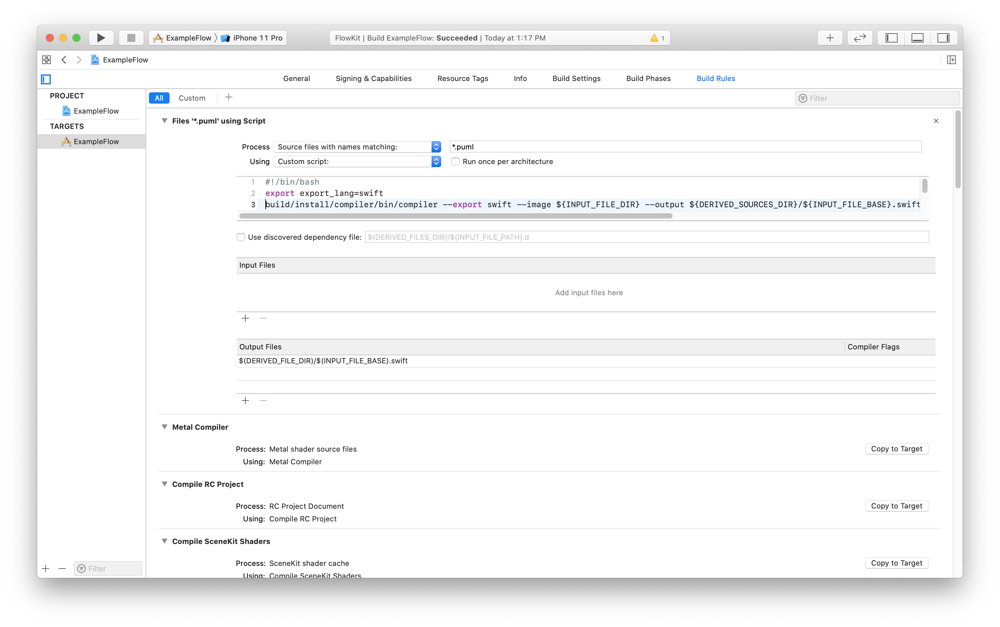
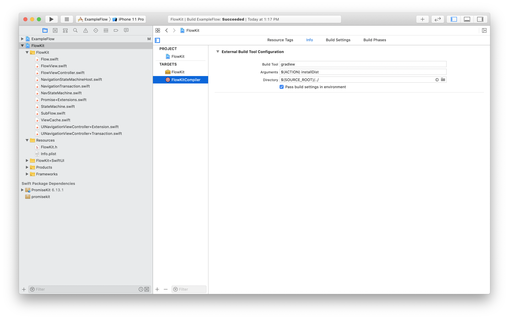

# FlowKit Installation

FlowKit has 2 components needed for your project.

## Compiler
FlowKit provides a compile time component that is installed on your build machine. It's primary purpose is to parse the puml files and generate the code for your platform. The compiler itself is implemented in Kotlin and can be built directly from a build.gradle, or installed on your system beforehand.

## Runtime Library

FlowKit also provides a runtime library that is required by the generated code. This runtime library is provided as a `Framework` or `Jar` file depending on the platform.

# Xcode / Swift

## CocoaPods
TODO

## Carthage
TODO

## SwiftPM
```swift
package.dependencies.append(
    .package(url: "https://github.com/inmotionsoftware/FlowKit", from: "0.1.8")
)
```

## Setting up the CodeGenerator in Xcode

We need to build / install the compiler toolchain to process `puml` files. To do so, we can setup a `build.gradle` to download and install the command line tools for FlowKit.

The compiler in FlowKit is implemented in Kotlin and uses a Java VM. You will need to install `java` on your machine, along with `Gradle`

gradle can be installed using homebrew
```bash
brew install gradle
```

Steps:
1. Create a `build.gradle` file to download and build the compiler.
2. Setup Xcode to handle `puml` files using the compiler
3. Setup Xcode to run the `build.gradle` to ensure the compiler gets built on first compile

### Create a `build.gradle` File
Next setup a `build.gradle` file. You can pull this from the example project, or use the following:

```groovy
apply plugin: 'java'
apply plugin: 'java-library'
apply plugin: 'kotlin'
apply plugin: 'application'

buildscript {
    ext.kotlin_version = '1.3.71'
    repositories {
        mavenCentral()
        google()
        jcenter()
        maven { url 'https://jitpack.io'}
    }
    dependencies {
        classpath 'com.android.tools.build:gradle:3.6.3'
        classpath "org.jetbrains.kotlin:kotlin-gradle-plugin:$kotlin_version"
        classpath 'net.sourceforge.plantuml:plantuml:1.2020.4'
        classpath 'com.github.inmotionsoftware.FlowKit:compiler:0.1.6'
        // NOTE: Do not place your application dependencies here; they belong
        // in the individual module build.gradle files
    }
}

repositories {
    mavenCentral()
    google()
    jcenter()
    maven { url 'https://jitpack.io'}
}

dependencies {
    implementation 'net.sourceforge.plantuml:plantuml:1.2020.4'
    implementation 'com.github.inmotionsoftware.FlowKit:compiler:0.1.6'
}

application {
    mainClassName = 'com.inmotionsoftware.flowkit.compiler.MainKt'
}
```

You then run:
```bash
gradle installDist
```

This will download and compile the command line tools. You will then add a custom build rule to Xcode to process any puml files.

### Configure custom Build Rule in Xcode

Xcode build rules settings



Add this to the custom script:

```bash
#!/bin/bash
export export_lang=swift
build/install/compiler/bin/compiler --export swift --image ${INPUT_FILE_DIR} --output ${DERIVED_SOURCES_DIR}/${INPUT_FILE_BASE}.swift ${INPUT_FILE_DIR}/${INPUT_FILE_NAME}
```
Output Files:
```bash
$(DERIVED_FILE_DIR)/$(INPUT_FILE_BASE).swift
```

This will generate the swift code along with png files for each puml file. The swift files will be automatically picked up by Xcode and compiled.

### Optionally build the compiler toolchain from Xcode
You can setup the compiler tools as an external build target in xcode.



You can then configure your app target to depend on the compiler

## Android

Since the compiler tools are built in Kotlin, you can simply setup your `build.gradle` to include the necessary dependencies.
FlowKit provides a Gradle plugin to simplify integrations with Gradle based projects.

All that is required to get the compiler working, is to include the FlowKit compiler as a dependency of the buildscript. In this example, we use jitpack to just reference the github project directly. You will also need `plantuml` which is a direct dependency of the compiler toolchain.

Once your gradle buildscript is setup, you can apply the `flow-kit-compiler` plugin. This plugin will look for any `puml` files and compile them into Kotlin code. As an option, you can configure the source directory, or the package for the generated code.

You will also need to add the runtime library to your dependencies along with `PromiseKt`

Finally, to ensure the compiler is invoked on `build` add a dependency on the build task.

```groovy
buildscript {
    ...
    repositories {
        ...
        maven { url 'https://jitpack.io'}
    }

    // compiler dependencies for the buildscript
    dependencies {
        ...
        classpath 'com.github.inmotionsoftware.FlowKit:compiler:0.1.8'
        classpath 'net.sourceforge.plantuml:plantuml:1.2020.4'
    }
}

apply plugin: 'flow-kit-compiler'

repositories {
    ...
    maven { url 'https://jitpack.io'}
}

...

// runtime dependencies
dependencies {
    ...
    implementation "com.github.inmotionsoftware:promisekt:1.0.0"
    implementation 'com.github.inmotionsoftware.FlowKit:lib:0.1.8'
}

// optional configuration
flowKit {
    namespace = 'com.mycompany.app' // package
    sourceDir = file('src/main/flows') // src directory
}

build.dependsOn compileFlow
```
